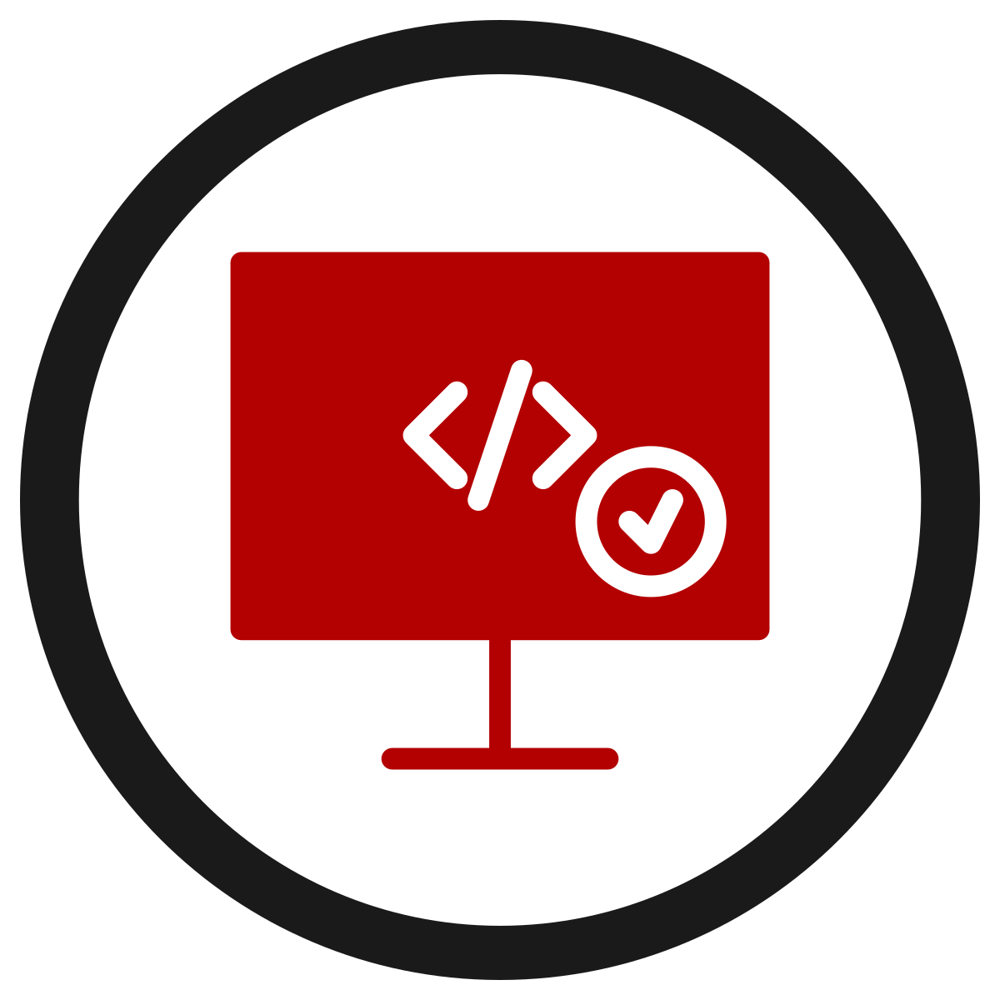

[![Contributors][contributors-shield]][contributors-url]
[![Forks][forks-shield]][forks-url]
[![Stargazers][stars-shield]][stars-url]
[![Issues][issues-shield]][issues-url]
[![MIT License][license-shield]][license-url]
[![LinkedIn][linkedin-shield]][linkedin-url]


<!-- PROJECT LOGO -->
<br />
<p align="center">
  <a href="https://github.com/CONDITIONBLACK/BulkRegexCheck">
    
  </a>

  <h3 align="center">Bulk Regex Check</h3>

  <p align="center">
    A simple, lightweight .NET Core(3.1) console application for validating Regular Expressions. This was developed for security researchers who were testing large numbers of regular expressions for use against data leaks or breaches. It uses the Crayon NuGet library to quickly help researchers identify expressions which are invalid. This is a VERY simple implementation meant to be run on any platform that supports .NET core console applications.
    <br />
    <a href="https://github.com/CONDITIONBLACK/BulkRegexCheck"><strong>Explore the docs »</strong></a>
    <br />
    <br />
  </p>
</p>


<!-- TABLE OF CONTENTS -->
<details open="open">
  <summary><h2 style="display: inline-block">Table of Contents</h2></summary>
  <ol>
    <li>
      <a href="#about-the-project">About The Project</a>
      <ul>
        <li><a href="#built-with">Built With</a></li>
      </ul>
    </li>
    <li>
      <a href="#getting-started">Getting Started</a>
      <ul>
        <li><a href="#prerequisites">Prerequisites</a></li>
      </ul>
    </li>
    <li><a href="#usage">Usage</a></li>
    <li><a href="#roadmap">Roadmap</a></li>
    <li><a href="#contributing">Contributing</a></li>
    <li><a href="#license">License</a></li>
    <li><a href="#contact">Contact</a></li>
  </ol>
</details>


<!-- ABOUT THE PROJECT -->
## About The Project

[![BulkRegexCheck Screen Shot][product-screenshot]]


### Built With

* [Crayon](https://github.com/riezebosch/crayon)


<!-- GETTING STARTED -->
## Getting Started

To get a local copy up and running follow these simple steps.

### Prerequisites

Crayon requires .NET Core.
* [Learn How to Install .NET Core on your OS](https://docs.microsoft.com/en-us/dotnet/core/install/)

### Build and Run

1. Clone the repo
   ```sh
   git clone https://github.com/CONDITIONBLACK/BulkRegexCheck.git
   ```
2. Open the BulkRegexCheck Solution in Visual Studio or Visual Studio Code (Free)

3. Build the Solution and Execute the console application in the console of your choice


<!-- USAGE EXAMPLES -->
## Usage

This console application takes a text file as input via user input prompt (This means it will ask you for the file path on start). Provide the file path with a single regular expression on each line (do not separate them with any delimiters or surround them with quotes etc.). The app will run a validation on every regular expression contained within the file and provide a color coded validation response along with the exact regex tested for each line.

For valid regular expressions they are marked in Green with a response: ``"The regular expression (?i)(['\"]?\\w*password['\"]? ?[:=] ?(['\"][^'\"]{4,}['\"])) is VALID"``

For INVALID regular expressions they are marked in RED with a response: ``"The regular expression (?i)(['\"]?pw['\"]? ?[:=]  is NOT VALID"``

This allows the user to quickly identify the regular expressions that require review prior to use.


<!-- ROADMAP -->
## Roadmap

We are not planning any major changes to this code at this time as it is meant to be a simple and quick solution to a common problem for individuals who may not have the coding or scripting experience to quickly build their own tooling but if you have an idea on how to make it better or add functionality we would welcome your input.

See the [open issues](https://github.com/CONDITIONBLACK/BulkRegexCheck/issues) for a list of proposed features (and known issues).


<!-- CONTRIBUTING -->
## Contributing

Contributions are what make the open source community such an amazing place and we would not be able to do what we do without it. Any contributions you make are **greatly appreciated**. 

1. Fork the Project
2. Create your Feature Branch (`git checkout -b feature/AmazingFeature`)
3. Commit your Changes (`git commit -m 'Add some AmazingFeature'`)
4. Push to the Branch (`git push origin feature/AmazingFeature`)
5. Open a Pull Request


<!-- LICENSE -->
## License

Distributed under the MIT License. See `LICENSE` for more information.


<!-- CONTACT -->
## Contact

Your Name - [@Shadow0pz](https://twitter.com/Shadow0pz) - security[@]condition[.]black

Project Link: [https://github.com/CONDITIONBLACK/BulkRegexCheck](https://github.com/CONDITIONBLACK/BulkRegexCheck)


<!-- MARKDOWN LINKS & IMAGES -->
<!-- https://www.markdownguide.org/basic-syntax/#reference-style-links -->
[contributors-shield]: https://img.shields.io/github/contributors/CONDITIONBLACK/BulkRegexCheck.svg?style=for-the-badge
[contributors-url]: https://github.com/CONDITIONBLACK/BulkRegexCheck/graphs/contributors
[forks-shield]: https://img.shields.io/github/forks/CONDITIONBLACK/BulkRegexCheck.svg?style=for-the-badge
[forks-url]: https://github.com/CONDITIONBLACK/BulkRegexCheck/network/members
[stars-shield]: https://img.shields.io/github/stars/CONDITIONBLACK/BulkRegexCheck.svg?style=for-the-badge
[stars-url]: https://github.com/CONDITIONBLACK/BulkRegexCheck/stargazers
[issues-shield]: https://img.shields.io/github/issues/CONDITIONBLACK/BulkRegexCheck.svg?style=for-the-badge
[issues-url]: https://github.com/CONDITIONBLACK/BulkRegexCheck/issues
[license-shield]: https://img.shields.io/github/license/CONDITIONBLACK/BulkRegexCheck.svg?style=for-the-badge
[license-url]: https://github.com/CONDITIONBLACK/BulkRegexCheck/blob/master/LICENSE
[linkedin-shield]: https://img.shields.io/badge/-LinkedIn-black.svg?style=for-the-badge&logo=linkedin&colorB=555
[linkedin-url]: https://linkedin.com/in/CONDITIONBLACK
[product-screenshot]: /screenshot.png
<!-- MARKDOWN LINKS & IMAGES -->
